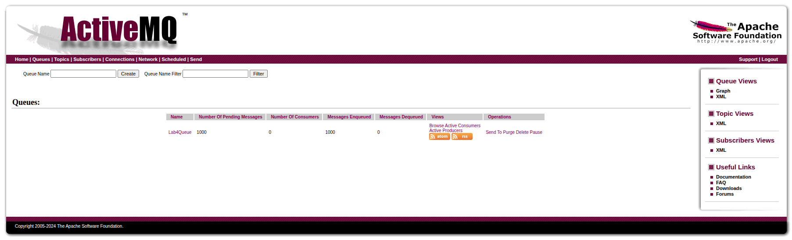
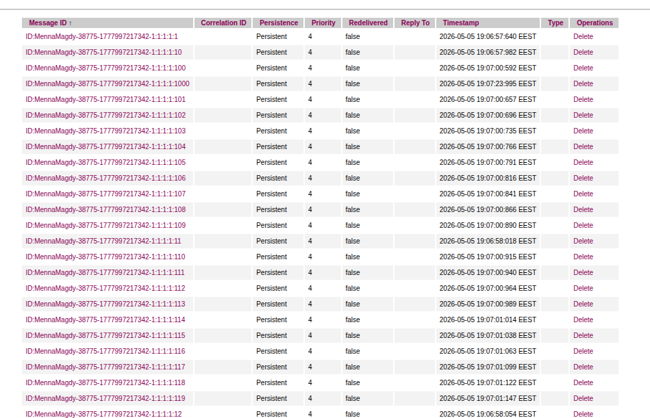
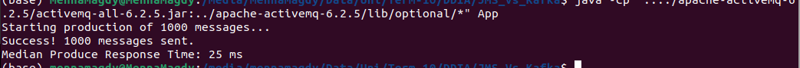

# JMS_Vs_Kafka

./activemq start

http://localhost:8161/

java -cp ".:../apache-activemq-6.2.5/activemq-all-6.2.5.jar:../apache-activemq-6.2.5/lib/optional/*" App

(other ways didn't work ->check why)

