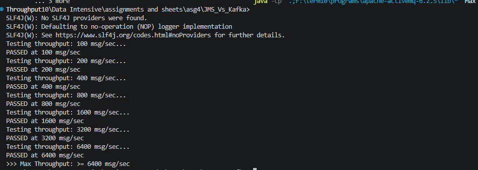
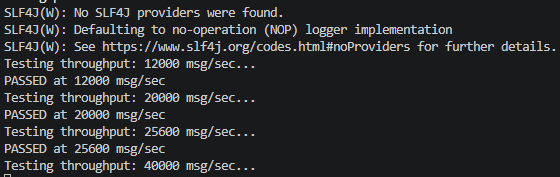

# JMS vs Kafka

## Starting ActiveMQ

**Linux:**
```bash
./activemq start
```

**Windows:**
```bash
bin\activemq.bat start
```

Web Console: `http://localhost:8161/`
> credentials — username: `admin` , password: `admin`


---

## Compiling

**Linux:**
```bash
java -cp ".:../apache-activemq-6.2.5/activemq-all-6.2.5.jar:../apache-activemq-6.2.5/lib/optional/*" App
```
> Note: other classpath formats didn't work on Linux — check why

**Windows:**
```bash
javac -cp "...\apache-activemq-6.2.5\activemq-all-6.2.5.jar" App.java Consumer.java MaxThroughput.java
```
or
```bash
javac -cp "...\apache-activemq-6.2.5\lib\*" App.java Consumer.java MaxThroughput.java
```
> Note: `lib\*` was used because some libraries weren't read properly from `activemq-all.jar`

---

## Running

```bash
java -cp ".;...\apache-activemq-6.2.5\lib\*" App

java -cp ".;...\apache-activemq-6.2.5\lib\*" Consumer

java -cp ".;...\apache-activemq-6.2.5\lib\*" MaxThroughput
```

> **Windows** uses `.;` — **Linux** uses `.:`

---

## Performance Metrics
### Running Order

#### 1. Producer Response Time
Run `App.java`


#### 2. Consume Response Time
Run `App` first, then `Consumer`

#### 3. End-to-End Latency
Run `App` and `Consumer` concurrently
> Do **not** start `Consumer` before `App` — it will freeze waiting for messages

#### 4. Max Throughput
Run `MaxThroughput` alone — it internally creates both a producer and consumer and measures throughput between them

running MaxThroughput through the following X values [100 , 200 , 400 , 800 , 1600 , 3200 , 6400]
 
then ran values [12000 , 20000, 25600 , 40000]
 


```
Test Plan
└── Thread Group
    ├── JMS Point-to-Point (Sampler)
    ├── View Results Tree (Listener)
    └── Summary Report (Listener)
```

**Thread Group Settings:**

| Setting | Value | Reason |
|---|---|---|
| Threads | 1 | Simulate single producer |
| Ramp-up | 1s | Apply all load immediately |
| Loop count | 100 |

**Constant Throughput Timer** — set Target throughput in samples per minute (X msg/sec × 60):

| msg/sec | Timer value (per minute) |
|---|---|
| 100 | 6,000 |
| 200 | 12,000 |
| 400 | 24,000 |
| 800 | 48,000 |


## Conclusion
**JMS/ActiveMQ** is the right tool for *reliable delivery of individual transactional messages* and the stack used itself is Java-centric.

**Kafka** is the right tool when you need *high-throughput event streaming, replayability, or multiple independent consumers* reading the same data.